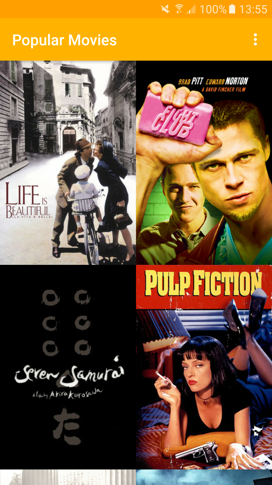
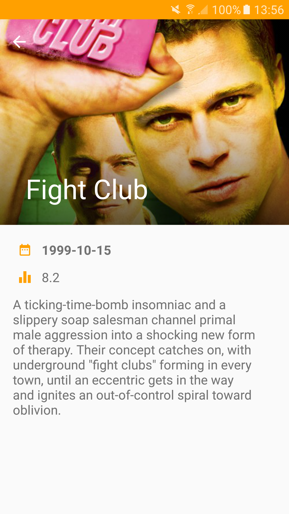

# Udacity-Stage1
Stage 1: Main Discovery Screen, A Details View, and Settings

# User Experience
The app will:
* Upon launch, present the user with an grid arrangement of movie posters.
* Allow your user to change sort order via a setting: the sort order can be by most popular, or by top rated
* Allow the user to tap on a movie poster and transition to a details screen with additional information.

# API Hints
To fetch popular movies, the app will use the API from themoviedb.org
* /movie/popular: get the popular movies
* /movie/top_rated: get the most rated movies

# Developed By

* Jota Ramirez - <jotaramirez90@gmail.com>

# License
	Copyright 2017 Jota Ramirez

	Licensed under the Apache License, Version 2.0 (the "License");
	you may not use this file except in compliance with the License.
	You may obtain a copy of the License at

		http://www.apache.org/licenses/LICENSE-2.0

	Unless required by applicable law or agreed to in writing, software
	distributed under the License is distributed on an "AS IS" BASIS,
	WITHOUT WARRANTIES OR CONDITIONS OF ANY KIND, either express or implied.
	See the License for the specific language governing permissions and
	limitations under the License.
